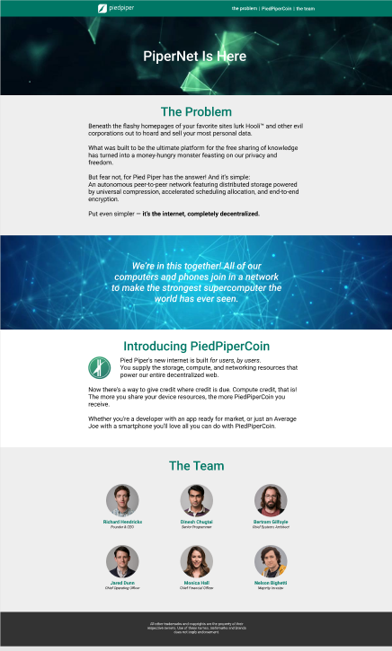
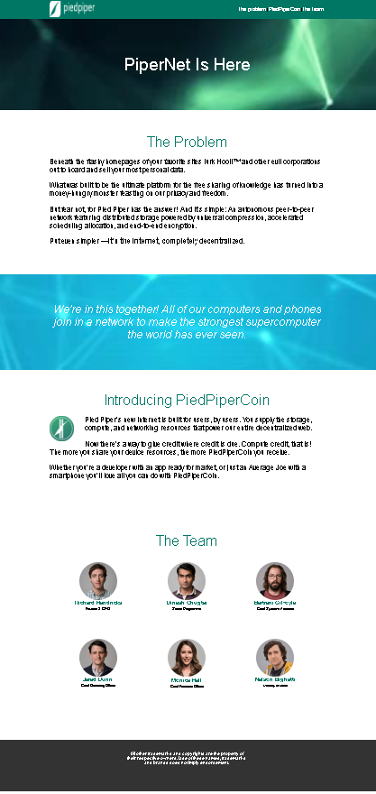

# PiedPiper — Landing Page
Учебный проект по вёрстке лендинга на основе готового макета из Figma.

## О проекте
В рамках задания необходимо было превратить готовый дизайн-макет в рабочую веб-страницу, используя HTML и CSS.
Основная задача - воспроизвести структуру и внешний вид макета, соблюдая заданные технические требования.

## Задание
Необходимо было сверстать лендинг технологического стартапа PiedPiper по предоставленному макету.
Основные требования:
- фиксированная ширина основного контейнера - 1219px;
- боковые отступы - 55px;
- шапка остаётся в верхней части экрана при прокрутке;
- логотип является ссылкой на начало страницы;
- контент секций выровнен по центру;
- для расположения блоков в ряд используется `display: inline-block`;
- свойство `position` используется только для шапки;
- по возможности размеры элементов задаются через `margin` и `padding`.

## Макет
Страница разработана на основе макета из Figma.
[Открыть макет в Figma]([ССЫЛКА_НА_FIGMA](https://www.figma.com/file/BL7wdCOSIxYFu1uxctuVzg/%D0%94%D0%BE%D0%BC%D0%B0%D1%88%D0%BD%D0%B5%D0%B5-%D0%B7%D0%B0%D0%B4%D0%B0%D0%BD%D0%B8%D0%B5-Pied-Piper?node-id=0%3A1))

### Исходный макет

### Моя реализация

## Технологии
- HTML5
- CSS3

## Реализовано
- шапка сайта;
- главный экран;
- информационные секции;
- блок с описанием PiedPiperCoin;
- блок с участниками команды;
- нижняя часть страницы;
- навигационная ссылка на начало страницы;
- фиксированная шапка при прокрутке;
- стилизация элементов в соответствии с макетом.

## Что было отработано
В процессе выполнения проекта были повторены и закреплены навыки:
- создание структуры HTML-документа;
- работа с изображениями и ссылками;
- создание и оформление блоков страницы;
- CSS-селекторы;
- `margin` и `padding`;
- позиционирование элементов;
- `display: inline-block`;
- работа с фиксированной шириной контейнера;
- организация CSS-стилей.
